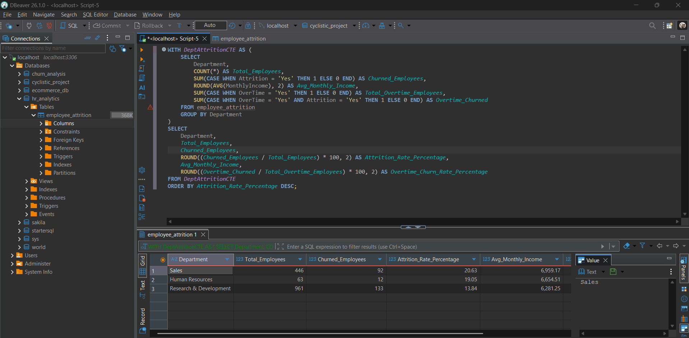

# 🌐 HR Workforce Optimization & Attrition Portal

A fully interactive, high-end web-based analytics application built to analyze employee turnover, identify burnout triggers, and provide actionable talent retention strategies.

🚀 **Live Interactive Dashboard:** [Click Here to View Live Portal](https://insightsbyash.github.io/hr-attrition-analysis/)

## 🗄️ SQL Data Transformation
I performed complex data extraction using SQL (DBeaver) to derive actionable attrition metrics.
* **Techniques Used:** CTEs (Common Table Expressions) and Conditional Aggregation.
* **Key Metric:** Calculated department-wise attrition rates and analyzed income correlation with turnover.

---

## 📊 Executive Business Insights
* **High Attrition Alert:** The organization faces an overall attrition rate of **16.12%**, with the **Sales Department** demonstrating the highest turnover risk across core business units.
* **Overtime Burnout Correlation:** A significant correlation is tracked between extended **Overtime hours** and employee departures, signaling a critical need for workload optimization.
* **Demographic Risk Management:** The **Under-25 age group** and single employees exhibit the highest propensity to leave, highlighting an urgent need for targeted early-career retention strategies.

---

## 🛠️ Tech Stack & Features
* **Core Architecture:** HTML5, Modern CSS3 (App-like UI with Sidebar Navigation & Floating Cards).
* **Data Visualization:** Interactive Chart.js engine providing real-time, multi-dimensional filtering.
* **Deployment:** Publicly accessible via GitHub Pages for seamless executive and recruiter review.
* **Interactive Filtering:** Perform granular analysis across **Gender**, **Business Travel Frequencies**, and **Key Job Roles** without page reloads.

---

## 📁 Repository Structure
* `index.html` - Complete frontend architecture, analytical engine, and UI layout.
  `employee_attrition_sql.png` - Visual proof of the SQL backend logic and CTE implementation.
* `README.md` - Project documentation and executive summary.
